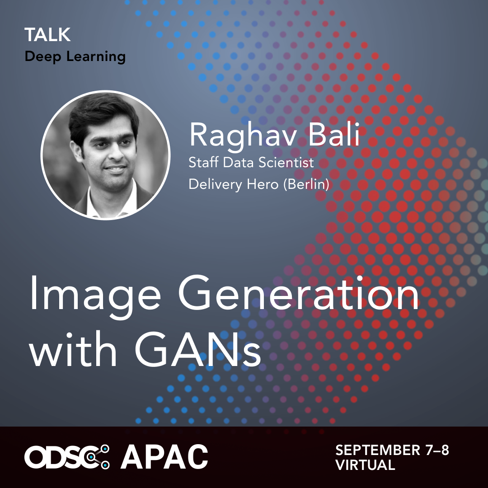

# Image Generation with GANs
> ODSC APAC 2022

## Details 
+ [Registration Link](https://odsc.com/apac/)
+ :alarm_clock: 1530 IST
+ :date: September 7th, 2022

## Agenda
- What Are Generative Models
- A bit about Generative Adversarial Networks (GANs)
- [Image Generation with GANs](https://github.com/raghavbali/gan_tutorial/blob/main/notebooks/handson_generate_images.ipynb) :sparkles:
- Applications of GANs
- Challenges

> Content of this talk is derived from the book __[Generative AI with Python and TensorFlow 2](https://www.amazon.in/Generative-AI-Python-TensorFlow-Transformer-ebook/dp/B0922PCNPS/ref=sr_1_1?dchild=1&keywords=generative+ai&qid=1629522690&sr=8-1)__

